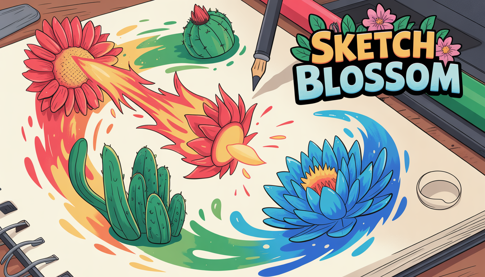

# Sketch Blossom



**Draw your way to victory!** Sketch Blossom is a turn-based battle 
game where **YOUR** drawings become your weapons. Sketch plants, unleash hand-drawn attacks,
and watch your art come to life as fiery flames, crashing waves, and tangling vines. 
An AI judges your drawing skill. the better you draw, the harder you hit. 
Collect 9 unique plants across Fire, Water, and Grass types. Tame defeated enemies. 
Upgrade your squad. But beware: lose a battle and your plant is gone forever. 
Every stroke matters. Every battle counts. Pick up your pen and fight. 
Are your drawing skills deadly enough?

Engine: Unity
Platforms: PC/Mac (Steam), Tablet, Mobile
Input Methods: Mouse (PC), Touch/Stylus (Tablet/Mobile)
Genre: Drawing-Based Battle Game
Theme: Draw to Fight

### Team Members
- Michael Dieterle - Project Lead, Lead Develop
- Sanja Nikolic - Gameplay Programmer
- Stefan - Core Technology Programmer
- Muhammet Taskin - UI Support

## Overview

Sketch Blossom is a turn-based drawing battle game where players draw plants and moves to fight. The core mechanic: **draw plants to collect, draw moves to attack**. It features roguelike permadeath, progressive collection/upgrade systems, and AI-powered plant recognition using TinyCLIP.

**Key highlights:**
- **CLIP AI-powered plant detection** using TinyCLIP zero-shot image classification for realistic plant recognition
- **CLIP AI-powered move recognition** — the same AI model also recognises the gestures you draw for attacks
- **Full color palette support** — draw with any color, not just primary RGB
- **36 unique battle moves** across 9 plant types with drawing quality-based damage
- **Visual move reference** — the in-battle guide book shows a small sketch of each gesture to draw
- **Live confidence display** — a small panel below the move list shows each move's confidence score after every drawing attempt, just like the plant-drawing scene
- **Roguelike permadeath** — lose a battle and your plant is gone forever
- **Working upgrade system** — Wild Growth screen lets you power up plants by drawing


## Core Gameplay Loop

The game features **turn-based drawing combat** where what you draw directly determines what happens in battle. Drawing quality affects damage output, and plant choice matters due to type advantages and permadeath consequences.

### 1. Draw Your Starting Plant

**Game Start:**
- Player draws a plant using the **full color palette** — any colors are accepted
- **TinyCLIP AI** analyzes the drawing and classifies it against 9 plant descriptions
- The dominant color determines the element: Red-toned = Fire, Green-toned = Grass, Blue-toned = Water
- **Invalid drawings are rejected** with feedback — must redraw until validation passes
- Each plant type has unique base stats (HP: 28-40, Attack: 8-20, Defense: 6-16)

**9 Plant Types:**

| Element | Plant | HP | ATK | DEF | Description |
|---------|-------|----|-----|-----|-------------|
| Fire | Sunflower | 30 | 18 | 8 | Radiant fire flower with circular petals |
| Fire | Fire Rose | 35 | 16 | 10 | Compact blazing rose with many layers |
| Fire | Flame Tulip | 28 | 20 | 6 | Tall elegant flame flower with simple shape |
| Grass | Cactus | 32 | 12 | 14 | Spiky vertical desert guardian |
| Grass | Vine Flower | 35 | 14 | 12 | Flowing curved vine with blooms |
| Grass | Grass Sprout | 30 | 10 | 16 | Bushy low-growing grass cluster |
| Water | Water Lily | 40 | 10 | 14 | Peaceful floating flower spreading wide |
| Water | Coral Bloom | 38 | 12 | 12 | Branching underwater coral flower |
| Water | Bubble Flower | 36 | 8 | 16 | Clustered bubble-like blooms |

### 2. Explore & Prepare

**World Map Navigation:**
- Explore the world map to find enemies
- Click enemies to preview their type and difficulty (1-5 stars)
- Choose when to engage in battle

**Plant Selection:**
- Before each battle, select which plant from your inventory to use
- Strategic choice based on type matchup and plant health
- **Permadeath risk**: Losing a battle permanently removes that plant

### 3. Battle System — Draw to Attack

**Turn-Based Combat:**
- **Player Turn**:
  1. Draw your attack/move on the battle canvas
  2. Click "Finish Drawing" to submit
  3. System analyzes pattern and recognizes move (or fails)
  4. Recognized move executes with quality-based damage
  5. Failed recognition = wasted turn, no damage
- **Enemy Turn**: AI opponent selects a move based on HP situation (heals when low, blocks when critical, attacks otherwise)

**36 Unique Moves** (4 per plant type):

Every plant has 4 moves with **unique drawing shapes** so no two moves within the same plant can be confused. The move structure per plant is:
1. **Block** (defensive, 0 power)
2. **Normal-type basic attack** (10 power, no type advantage — Sting/Cut/Bump)
3. **Typed standard attack** (15 power, has type advantage)
4. **Typed strong attack** (20-25 power, has type advantage, 1-turn cooldown)

Each move specifies a `DrawingShape` that determines how it's detected. Detection uses the move's shape — not its type — so the same move type (e.g., Block) can require different shapes on different plants.

### Drawing Shapes

There are **13 distinct drawing shapes** used across all plants. Each plant picks 4 maximally different shapes:

| Shape | What to Draw | Geometric Signature |
|-------|-------------|-------------------|
| Circle | Single closed round stroke | 1 stroke, circular, not spiky |
| StraightLine | Single straight line | 1 stroke, not circular/spiky/curved |
| Zigzag | Sharp back-and-forth | 1 stroke, spiky, not circular |
| WavyLine | Curved horizontal stroke | 1 stroke, curved, horizontal |
| Plus | Two crossing lines (+) | 2 strokes, one H + one V |
| XCross | Two diagonal crossing lines (X) | 2 strokes, diagonal |
| Arrow | Line with V tip | 2-3 strokes, has sharp angle |
| MultipleCircles | 3 small circles | 3+ circular strokes |
| Star | Lines radiating from center | 3+ strokes, radial pattern |
| Square | Closed shape with 4 corners | 1 stroke, closed + sharp corners |
| Triangle | Closed shape with 3 corners | 1 stroke, closed + sharp corners |
| Checkmark | V-shaped stroke | 1 stroke, one sharp turn, open |
| Spiral | Curved non-closed stroke | 1 stroke, curved, not closed |

**Fire Plant Movesets:**

| Plant | Move | Power | Element | Shape to Draw | Cooldown | Description |
|-------|------|-------|---------|---------------|----------|-------------|
| Sunflower | Block | 0 | Fire | Square | — | Create a protective golden shield |
| Sunflower | Sting | 10 | Normal | Straight line | — | A quick stinging jab of solar energy |
| Sunflower | Fireball | 15 | Fire | Circle | — | Launch a blazing sphere of solar fire |
| Sunflower | Solar Flare | 25 | Fire | Zigzag | 1 turn | Unleash intense burning rays |
| Fire Rose | Block | 0 | Fire | X shape | — | Thorny petals form a defensive barrier |
| Fire Rose | Sting | 10 | Normal | Arrow | — | A sharp thorn jabs the enemy |
| Fire Rose | Ember Petals | 15 | Fire | Star | — | Burning rose petals rain down on foes |
| Fire Rose | Passion Burst | 25 | Fire | Spiral | 1 turn | Explosive fire erupts from blooming roses |
| Flame Tulip | Block | 0 | Fire | Triangle | — | Tulip petals close into a protective shell |
| Flame Tulip | Sting | 10 | Normal | Checkmark | — | A swift fiery poke singes the target |
| Flame Tulip | Flame Strike | 15 | Fire | Circle | — | A precise beam of concentrated fire |
| Flame Tulip | Inferno Wave | 25 | Fire | Wavy line | 1 turn | A devastating wave of scorching heat |

**Grass Plant Movesets:**

| Plant | Move | Power | Element | Shape to Draw | Cooldown | Description |
|-------|------|-------|---------|---------------|----------|-------------|
| Cactus | Block | 0 | Grass | Square | — | Harden into a spiny defensive posture |
| Cactus | Cut | 10 | Normal | Straight line | — | A quick slash with a sharp spine |
| Cactus | Needle Shot | 15 | Grass | Arrow | — | Fire sharp cactus needles at enemies |
| Cactus | Spine Storm | 25 | Grass | Star | 1 turn | A relentless barrage of sharp spines |
| Vine Flower | Block | 0 | Grass | Triangle | — | Vines coil into a protective shield |
| Vine Flower | Cut | 10 | Normal | X shape | — | A swift vine slices through the air |
| Vine Flower | Vine Lash | 15 | Grass | Spiral | — | A powerful whipping vine strikes with force |
| Vine Flower | Strangling Roots | 25 | Grass | Zigzag | 1 turn | Massive roots bind and crush the enemy |
| Grass Sprout | Block | 0 | Grass | Triangle | — | Young sprouts form a protective wall |
| Grass Sprout | Cut | 10 | Normal | Checkmark | — | A sharp leaf blade slashes the foe |
| Grass Sprout | Razor Leaf | 15 | Grass | Star | — | Sharp grass blades slice through the air |
| Grass Sprout | Growth Surge | 25 | Grass | Plus sign | 1 turn | Rapid growing roots assault the target |

**Water Plant Movesets:**

| Plant | Move | Power | Element | Shape to Draw | Cooldown | Description |
|-------|------|-------|---------|---------------|----------|-------------|
| Water Lily | Block | 0 | Water | Square | — | Float on a cushion of protective water |
| Water Lily | Bump | 10 | Normal | Arrow | — | A forceful watery shove |
| Water Lily | Lily Splash | 15 | Water | Wavy line | — | Gentle waves wash over the enemy |
| Water Lily | Tranquil Petals | 20 | Water | Plus sign | 1 turn | Soothing lily petals restore health |
| Coral Bloom | Block | 0 | Water | Triangle | — | Coral hardens into a defensive formation |
| Coral Bloom | Bump | 10 | Normal | Straight line | — | A solid coral headbutt |
| Coral Bloom | Coral Spike | 15 | Water | Zigzag | — | Sharp coral projectiles pierce enemies |
| Coral Bloom | Tidal Burst | 25 | Water | 3 circles | 1 turn | Explosive pressurized water bubbles |
| Bubble Flower | Block | 0 | Water | Square | — | Surround yourself with protective bubbles |
| Bubble Flower | Bump | 10 | Normal | Arrow | — | A bubbly body slam |
| Bubble Flower | Bubble Barrage | 15 | Water | 3 small circles | — | Countless bubbles bombard the target |
| Bubble Flower | Bubble Remedy | 20 | Water | Plus sign | 1 turn | Healing bubbles restore vitality |

**Move Recognition Pipeline:**

Recognition uses two layers that work together for maximum robustness:

1. **TinyCLIP shape classification** — the drawing is captured as a texture and sent to the same Python AI server used for plant recognition. The server compares it against shape descriptions and returns the best-matching label with a confidence score (0–1). Labels are mapped to `DrawingShape` values for boosting.
2. **Geometric heuristics** — stroke patterns (circular, vertical, horizontal, spiky, curved) are analysed locally without any server round-trip. Each of the 13 `DrawingShape` types has its own dedicated scoring function.

Detection routes through `moveData.drawingShape` (not `moveType`), so the same move type used by different plants can require different drawing gestures. The final score for each candidate move is `geometric_score + (clip_confidence × 0.6)` clamped to 1.0. If the server is unavailable or confidence is below 0.2 the system falls back to geometry alone. A combined confidence of ≥ 0.5 is required to accept a move.

**Live Confidence Display:**

After every drawing attempt a small panel appears below the available-moves list showing all evaluated moves ranked by confidence, mirroring what the plant-drawing scene shows. The panel uses coloured bars:
- **Green (✓)** — the move that was recognised and accepted
- **Amber (?)** — the best-guess move when recognition failed (below threshold)
- **Grey** — all other candidate moves

The panel also shows the drawing quality rating and the resulting damage multiplier. It is hidden automatically at the start of each new turn, and when the player clears their canvas.

**Drawing Quality Matters:**
- System scores how well your drawing matches the intended move (0.0 - 1.0)
- Quality multipliers affect damage:
  - **Perfect** (>=0.9): 1.5x damage
  - **Excellent** (>=0.75): ~1.3x damage
  - **Good** (>=0.6): ~1.1x damage
  - **Decent** (>=0.4): 1.0x damage
  - **Poor** (<0.4): 0.5x damage minimum
- Visual feedback shows recognition quality after each turn

**Type Advantage System:**
- **Water > Fire**: 1.5x damage (super effective)
- **Fire > Grass**: 1.5x damage (super effective)
- **Grass > Water**: 1.5x damage (super effective)
- Reverse matchups: 0.5x damage (not very effective)
- Same type: 1.0x (neutral)
- **Normal**: 1.0x damage to any type (no advantage or disadvantage)

**Damage Formula:**
```
damage = (movePower + attackStat) x qualityMultiplier x typeAdvantage x defenseReduction
if blocking: damage x 0.5
```

### 4. Victory, Defeat & Progression

**Victory Path:**
- Enemy HP reaches 0 -> Battle won
- **Post-Battle Choice**:
  - **Wild Growth**: Upgrade current plant permanently (+50% to all stats)
  - **Tame**: Add defeated enemy to your plant inventory — the tamed plant is re-analyzed by CLIP AI to determine its type

**Defeat Path (Roguelike Permadeath):**
- Your plant's HP reaches 0 -> **Plant dies permanently** and is removed from inventory
- **If you have other plants**: Return to plant selection, choose another, continue
- **If no plants remain**: **GAME OVER** -> Return to main menu, start fresh

**Wild Growth Upgrade Screen:**
- After choosing Wild Growth, the player draws **one stroke** on the defeated plant
- **Geometric quality scoring** determines upgrade strength (1.3x - 1.8x multiplier based on stroke length/coverage)
- **Color-based stat bias**: The stroke's color influences which stat gets the most growth:
  - Red tint -> Attack bias
  - Blue tint -> HP bias
  - Green tint -> Defense bias
- Live preview shows HP/ATK/DEF before and after the upgrade
- The stroke is merged with the original plant drawing, visually evolving your plant

**Tame Growth:**
- When you tame a defeated plant, you must **redraw the plant in your own imagination**
- The process is similar to the initial drawing scene — draw freely using the full color palette
- TinyCLIP AI classifies your drawing to determine the tamed plant's type
- This means the tamed plant becomes *your* version of it, not a copy of the enemy's

## Key Design Pillars

**Drawing Recognition is Core:**
- Success depends on drawing recognizable moves
- TinyCLIP AI allows natural, artistic plant drawings instead of rigid patterns
- Full color palette means creative freedom in how you draw
- Skill-based combat through drawing accuracy

**Type System:**
- Water > Fire > Grass > Water (rock-paper-scissors with 1.5x/0.5x multipliers)
- Normal attacks deal 1.0x damage to any type — consistent but no advantage
- 9 unique plant types (3 per element) with distinct stats
- 36 unique moves (4 per plant type): Block, Normal attack, Typed standard, Typed strong

**Roguelike Risk:**
- Permadeath: Losing a battle permanently removes that plant
- Strategic resource management: Use strong plants or preserve them?
- Progression through collection (taming) and upgrades (wild growth)

## Development Status

**Completed:**
1. Plant drawing with full color palette support
2. TinyCLIP AI-powered plant detection (9 plant types)
3. Turn-based battle system with drawing input
4. Moveset detection with quality scoring (36 moves, 13 unique drawing shapes)
5. Attack execution with type advantages and animations
6. Failure recognition handling
7. World map exploration and enemy encounters
8. Post-battle reward selection (Wild Growth / Tame)
9. Wild Growth upgrade screen with drawing-based stat upgrades
10. Taming system — add defeated enemies to inventory
11. Permadeath and game over mechanics
12. Plant inventory management with persistence
13. TinyCLIP Python server auto-setup (Windows)
14. **TinyCLIP-assisted move recognition** — 13 drawing shapes with per-move `DrawingShape` detection; CLIP confidence boosts the geometric score for much more reliable detection
15. **Unique shapes per plant** — each plant's 4 moves use maximally distinct drawing shapes (e.g., BubbleFlower: Square, Arrow, 3 Circles, Plus) so no two moves can be confused
16. **Normal-type basic attacks** — Sting (Fire), Cut (Grass), Bump (Water) deal consistent 1.0x damage regardless of matchup
17. **Move cooldowns** — strong typed attacks have a 1-turn cooldown to encourage varied move usage
18. **Visual move reference previews** — guide book generates a small procedural sketch of each gesture shape per page so players always know what to draw
16. **Live confidence display** — `MoveConfidenceDisplay` panel shows ranked confidence bars for all candidate moves after every drawing attempt (green = recognised, amber = best guess, grey = others), plus quality rating and damage multiplier
17. **Codebase cleanup** — `MoveRecognitionSystem` removed; its quality-scoring logic is now inlined directly into `MovesetDetector`, and the old non-CLIP `DetectMove()` path is gone — the system always uses CLIP-assisted detection

**Still To Do:**
- [ ] **Switch plants in battle** — Allow players to swap to a different plant from their inventory mid-battle
- [ ] **Add more plants** — Expand beyond the current 9 plant types with new designs and stat profiles
- [ ] **Smarter enemy AI** — Current AI uses basic HP-aware strategy (heals below 40%, blocks below 25%, prefers strong moves above 60%). Could benefit from type awareness and adaptation to player patterns
- [ ] **More enemies** — Increase the number and variety of enemy encounters on the world map
- [ ] **Difficulty levels** — Implement tiered difficulty where harder enemies have more health, access to more plants, or stronger moves:
  - Easy (1-2 stars): Low stats, random moves, no blocking
  - Medium (3 stars): Balanced stats, type awareness, blocks at low HP
  - Hard (4-5 stars): High stats, full strategy, counter-play
- [ ] **Battle animation polish** — Projectile trajectories, impact animations, plant reaction animations, floating damage numbers
- [ ] **Audio system** — Sound effects and music
- [ ] **Tutorial system** — Guided introduction for new players

## Detailed Gameplay Diagram
```
+---------------------------------------------------+
|           MAIN MENU SCENE                         |
|  -> Start New Game / Continue                     |
+-----------------------+---------------------------+
                        |
                        v
+---------------------------------------------------+
|  DRAWING SCENE - Create Your First Plant          |
|  -> Drawing canvas with full color palette        |
|  -> Draw any plant freely (no color restrictions) |
|  -> TinyCLIP AI classifies your drawing           |
|  -> Guidebook available for reference             |
+-----------------------+---------------------------+
                        |
                        v
+---------------------------------------------------+
|  CLIP AI PLANT VALIDATION                         |
|  -> Drawing sent to TinyCLIP server               |
|  -> Zero-shot classification against 9 labels     |
|  -> Color analysis determines element type        |
|  -> Score >= 0.2: valid, >= 0.27: good result     |
|                                                   |
|  VALID: Plant created with stats & moves          |
|  INVALID: Must redraw (feedback provided)         |
+-----------------------+---------------------------+
                        |
                        v
+---------------------------------------------------+
|  WORLD MAP SCENE - Explore & Find Battles         |
|  -> Navigate map to discover enemies              |
|  -> Click enemy for preview:                      |
|     - Enemy type (Fire/Grass/Water)               |
|     - Difficulty (1-5 stars)                      |
|     - Stats preview                               |
|  -> Choose when to engage                         |
+-----------------------+---------------------------+
                        |
                        v
+---------------------------------------------------+
|  PLANT SELECTION SCENE                            |
|  -> View your plant inventory                     |
|  -> Each plant shows:                             |
|     - Type, HP, Attack, Defense                   |
|     - Current condition                           |
|  -> Select plant for upcoming battle              |
|  -> Strategic choice based on type matchup        |
+-----------------------+---------------------------+
                        |
                        v
+---------------------------------------------------+
|  DRAWING BATTLE SCENE - TURN-BASED COMBAT         |
|  -> Player plant vs Enemy plant displayed         |
|  -> HP bars, stats, turn indicator                |
|  -> Move guidebook available                      |
+-----------------------+---------------------------+
                        |
                        v
+---------------------------------------------------+
|  PLAYER TURN LOOP                                 |
|                                                   |
|  1. DRAW YOUR MOVE                                |
|     -> Drawing canvas activates                   |
|     -> Draw attack pattern                        |
|     -> Click "Finish Drawing"                     |
|                                                   |
|  2. MOVE RECOGNITION & QUALITY SCORING            |
|     -> Drawing captured as texture                |
|     -> TinyCLIP classifies gesture shape (13)     |
|     -> Geometric heuristics as fallback/boost     |
|     -> Combined score: geometric + CLIP boost     |
|     -> Confidence threshold (>= 0.5 required)     |
|     -> Quality calculation (0.0 - 1.0):           |
|        Perfect (>=0.9) -> 1.5x damage             |
|        Good (>=0.6) -> 1.1x damage                |
|        Poor (<0.4) -> 0.5x damage                 |
|                                                   |
|     RECOGNIZED: Move proceeds to execution        |
|     NOT RECOGNIZED: Turn wasted, no damage        |
|                                                   |
|  3. MOVE EXECUTION (if recognized)                |
|     -> Calculate damage with type advantage       |
|     -> Animation: Drawing becomes projectile      |
|     -> Screen shake (intensity by move power)     |
|     -> Apply damage to enemy                      |
+-----------------------+---------------------------+
                        |
                        v
+---------------------------------------------------+
|  ENEMY TURN                                       |
|  -> AI selects move based on HP + cooldowns       |
|  -> Perfect execution (1.0 quality always)        |
|  -> Same damage calculation with type advantage   |
|  -> Apply damage to player plant                  |
+-----------------------+---------------------------+
                        |
                        v
                  Battle Over?
                        |
            +-----------+-----------+
            |                       |
            v                       v
      Enemy HP <= 0           Player HP <= 0
       (VICTORY)               (DEFEAT)
            |                       |
            |                       v
            |         +-----------------------------+
            |         |  ROGUELIKE PERMADEATH       |
            |         |  -> Plant dies PERMANENTLY  |
            |         |  -> Removed from inventory  |
            |         |                             |
            |         |  0 plants -> GAME OVER      |
            |         |    -> Return to Main Menu   |
            |         |  1+ plants -> Continue      |
            |         |    -> Plant Selection       |
            |         +-----------------------------+
            |
            v
+---------------------------------------------------+
|  POST-BATTLE SCENE - Victory Rewards              |
|  -> Choose reward path:                           |
|                                                   |
|  Option 1: WILD GROWTH                            |
|    -> Draw one stroke on defeated plant           |
|    -> Stroke quality determines upgrade strength  |
|    -> Stroke color biases stat growth             |
|    -> +50% stats permanently                      |
|                                                   |
|  Option 2: TAME (Tame Growth)                      |
|    -> Redraw the defeated plant in your own style |
|    -> Similar to initial drawing scene            |
|    -> CLIP AI classifies your drawing             |
|    -> Tamed plant added to your inventory         |
+-----------------------+---------------------------+
                        |
                        v
            Return to WORLD MAP SCENE
            (Loop: Explore -> Battle -> Grow)
```

## Unity Technical Architecture

```
UnityGameFiles/
+-- Assets/
|   +-- Scripts/
|   |   +-- Drawing/
|   |   |   +-- SimpleDrawingCanvas.cs        Mouse/touch drawing with stroke tracking
|   |   |   +-- BattleDrawingCanvas.cs        Battle-specific drawing (thick lines)
|   |   |   +-- DrawingSceneManager.cs        Initial plant creation flow
|   |   |   +-- PlantGuideBook.cs             Interactive hint system
|   |   |   +-- DrawingSceneUI.cs             Enhanced UX with feedback
|   |   |
|   |   +-- Recognition/
|   |   |   +-- PlantRecognitionSystem.cs     CLIP AI + color analysis (9 plant types)
|   |   |   +-- MovesetDetector.cs            DrawingShape-based recognition + CLIP boost + quality scoring
|   |   |
|   |   +-- Combat/
|   |   |   +-- DrawingBattleSceneManager.cs  Main battle controller (turn-based loop, CLIP move query)
|   |   |   +-- BattleUnit.cs                 Plant stats, HP tracking, blocking
|   |   |   +-- MoveData.cs                   All 36 moves with properties + DrawingShape
|   |   |   +-- MoveExecutor.cs               Move execution with animations
|   |   |   +-- MoveGuideBook.cs              In-battle move reference with visual shape previews
|   |   |   +-- MoveShapePreview.cs           Procedural gesture preview textures (13 shapes)
|   |   |   +-- MoveConfidenceDisplay.cs      Live confidence bar panel after each drawing attempt
|   |   |
|   |   +-- World/
|   |   |   +-- WorldMapSceneManager.cs       Enemy exploration & battle preview
|   |   |   +-- PlantSelectionSceneManager.cs Choose plant before battle
|   |   |   +-- PostBattleManager.cs          Wild Growth / Tame choice
|   |   |   +-- WildGrowthSceneManager.cs     Upgrade screen with drawing input
|   |   |   +-- TameSceneManager.cs           Add enemy to inventory
|   |   |
|   |   +-- Model/
|   |   |   +-- PythonServerManager.cs        TinyCLIP server lifecycle management
|   |   |   +-- ModelManager.cs               HTTP client for Python backend
|   |   |
|   |   +-- Data/
|   |   |   +-- PlayerInventory.cs            Plant collection management
|   |   |   +-- DrawnPlantData.cs             Serialized plant data
|   |   |   +-- EncounterData.cs              Enemy difficulty & stats
|   |   |
|   |   +-- UI/
|   |       +-- MainMenuManager.cs            Game start
|   |       +-- PlantDetectionFeedback.cs     Validation feedback
|   |       +-- (Various battle UI components) HP bars, turn indicators
|   |
|   +-- Python/
|   |   +-- shared/
|   |       +-- TinyCLIP.py                   FastAPI server for CLIP classification
|   |       +-- labelMaps.json                Plant, move-shape (13 shapes), & upgrade label definitions
|   |
|   +-- Scenes/
|       +-- MainMenuScene.unity               Entry point
|       +-- DrawingScene.unity                First plant creation
|       +-- WorldMapScene.unity               Enemy exploration
|       +-- PlantSelectionScene.unity         Pre-battle plant choice
|       +-- DrawingBattleScene.unity          Main turn-based combat
|       +-- PostBattleScene.unity             Victory rewards
|       +-- WildGrowthScene.unity             Stat upgrade with drawing
|       +-- TameScene.unity                   Add enemy to roster
|       +-- InventoryScene.unity              View plant collection
```

## Key File References

| File | Purpose |
|------|---------|
| `DrawingBattleSceneManager.cs` | Main battle controller — turn-based loop, CLIP move query, damage |
| `PlantRecognitionSystem.cs` | CLIP AI plant detection & validation (9 types) |
| `MovesetDetector.cs` | DrawingShape-based move recognition with 13 shape detectors + CLIP boost + quality scoring |
| `MoveConfidenceDisplay.cs` | Live confidence bar panel shown after each drawing attempt |
| `MoveShapePreview.cs` | Procedural reference-drawing generator for the guide book (13 shapes) |
| `MoveGuideBook.cs` | In-battle move reference with visual shape previews |
| `MoveData.cs` | All 36 moves with stats, colors, effects, and DrawingShape per move |
| `BattleUnit.cs` | Unit stats, HP tracking, blocking |
| `PlayerInventory.cs` | Plant collection persistence |
| `WildGrowthSceneManager.cs` | Upgrade screen with drawing-based stat upgrades |
| `PythonServerManager.cs` | TinyCLIP Python server lifecycle |
| `ModelManager.cs` | HTTP client for classification requests |
| `TinyCLIP.py` | FastAPI server running TinyCLIP model |
| `labelMaps.json` | Plant, move-shape (13 drawing shapes), and upgrade label definitions |
